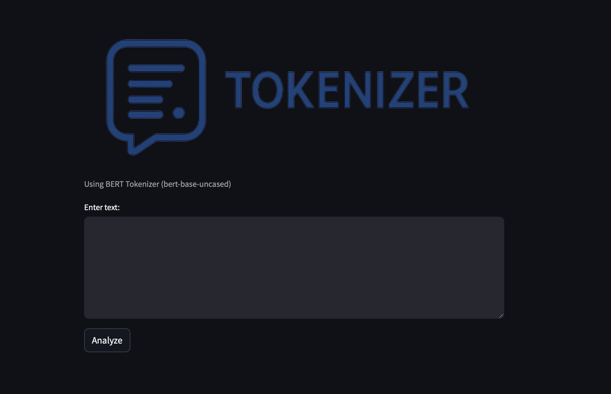
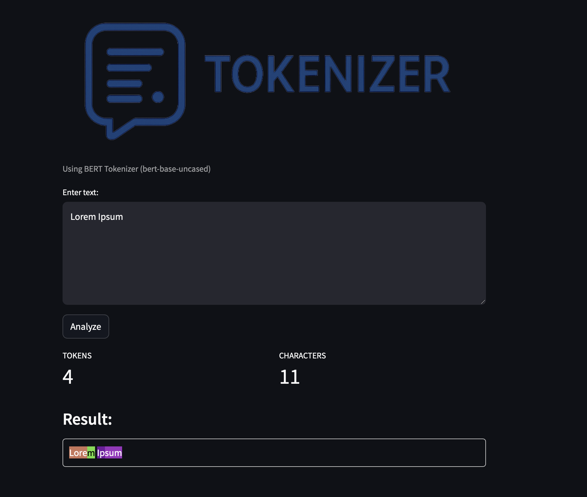

# Tokenizer Playground

<p align="center">
  
</p>  

A web application that visualizes how transformer models tokenize text. This tool helps understand how BERT and similar models break down text into tokens before processing.

## Features

- **Interactive Text Analysis**: Enter any text and see how it gets tokenized in real-time
- **Visual Token Highlighting**: Each token is highlighted with a unique color for easy identification
- **Token & Character Counts**: Instantly see the number of tokens and characters in your text
- **BERT Tokenization**: Uses the bert-base-uncased tokenizer from Hugging Face

## Demo

<p align="center">
  
</p>  

## Installation

### Prerequisites

- Python 3.13
- pip

### Setup

1. Clone the repository:
   ```bash
   git clone git@github.com:giova86/Streamlit-Tokenizer.git
   cd Streamlit-Tokenizer
   ```

2. Create virtual environment
   ```
   python3.13 -m venv venv
   source venv/bin/activate
   ```

3. Install the required packages:
   ```bash
   pip install -r requirements.txt
   ```

4. Run the application:
   ```bash
   streamlit run app.py
   ```

5. Open your browser and navigate to the URL displayed in your terminal (typically http://localhost:8501)


## Usage

1. Enter or paste text in the input field
2. Click the "Analyze" button
3. View the tokenization results with color-coded highlighting
4. Check the token and character counts

## Why Tokenizer Playground?

Understanding tokenization is crucial when working with transformer models like BERT, GPT, and others. This tool provides a visual way to:

- Debug text preprocessing issues in NLP pipelines
- Understand token limits for large language models
- See how special characters and words are handled by tokenizers
- Optimize prompt engineering for chatbots and AI assistants

## Implementation Details

The application is built with:

- **Streamlit**: For the web interface
- **Hugging Face Transformers**: For the tokenization functionality
- **Python**: As the core programming language

## Contributing

Contributions are welcome! Please feel free to submit a Pull Request.

1. Fork the repository
2. Create your feature branch (`git checkout -b feature/amazing-feature`)
3. Commit your changes (`git commit -m 'Add some amazing feature'`)
4. Push to the branch (`git push origin feature/amazing-feature`)
5. Open a Pull Request


## Acknowledgments

- [Hugging Face](https://huggingface.co/) for their amazing transformers library
- [Streamlit](https://streamlit.io/) for making it easy to build data apps

## Contact

Your Name - [@your_twitter](https://twitter.com/your_twitter) - email@example.com

Project Link: [https://github.com/username/tokenizer-playground](https://github.com/username/tokenizer-playground)
